# Appliance Installation

!!! note "Using the Firefly Logger Appliance is the recommended installation type for Firefly Logger."

!!! tip "You *do not* need to follow these directions *and* "Software Installation" "

## Appliance Full Installation Guide
This guide walks through flashing Raspberry Pi OS to an SD card
with the Raspberry Pi imager and then running the commands
necessary to install the rest of the software. Firefly Logger
no longer offers a premade image.

1. If you do not already have it installed, install the
[Raspberry Pi Imager](https://www.raspberrypi.com/software/).

2. Launch **Raspberry Pi Imager** from the start menu.

    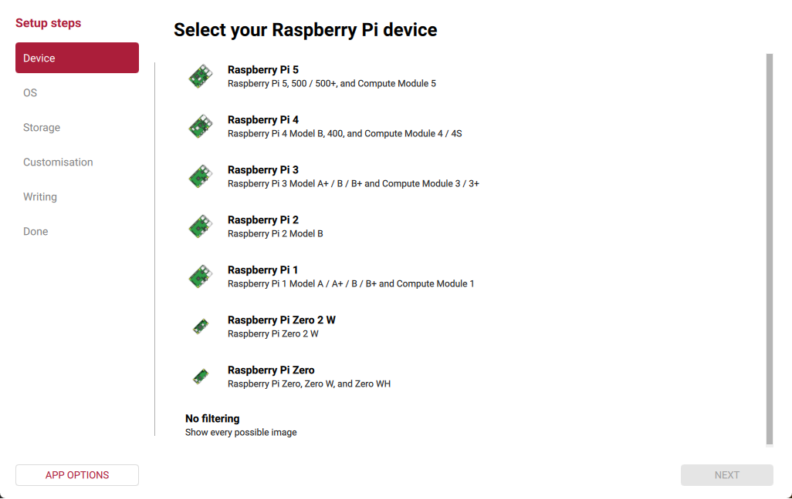{width="600"}

    Select the Raspberry Pi device you intend to use and
    click **NEXT**.

3. Select the option **Raspberry Pi OS (other)**

    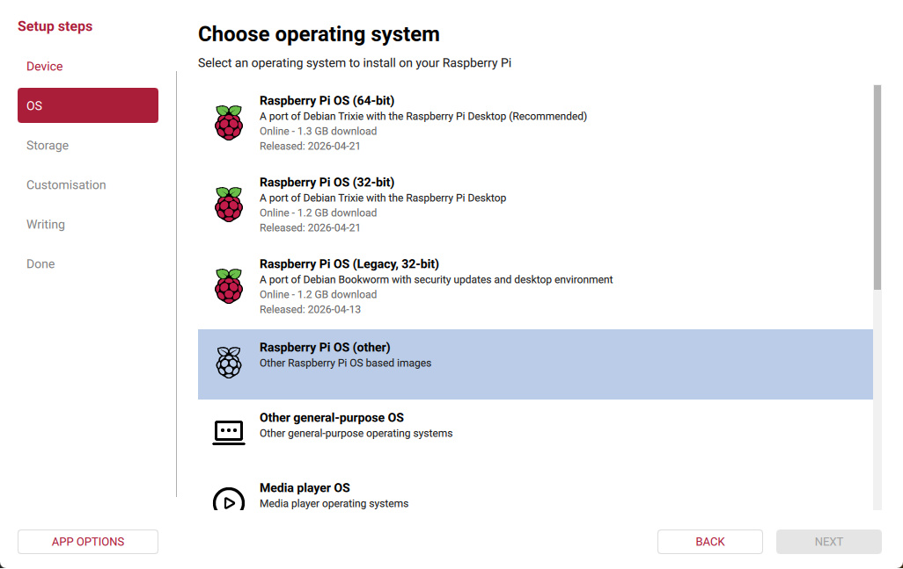{width="600"}

    and then select **Raspberry Pi OS Lite (64-bit)**

    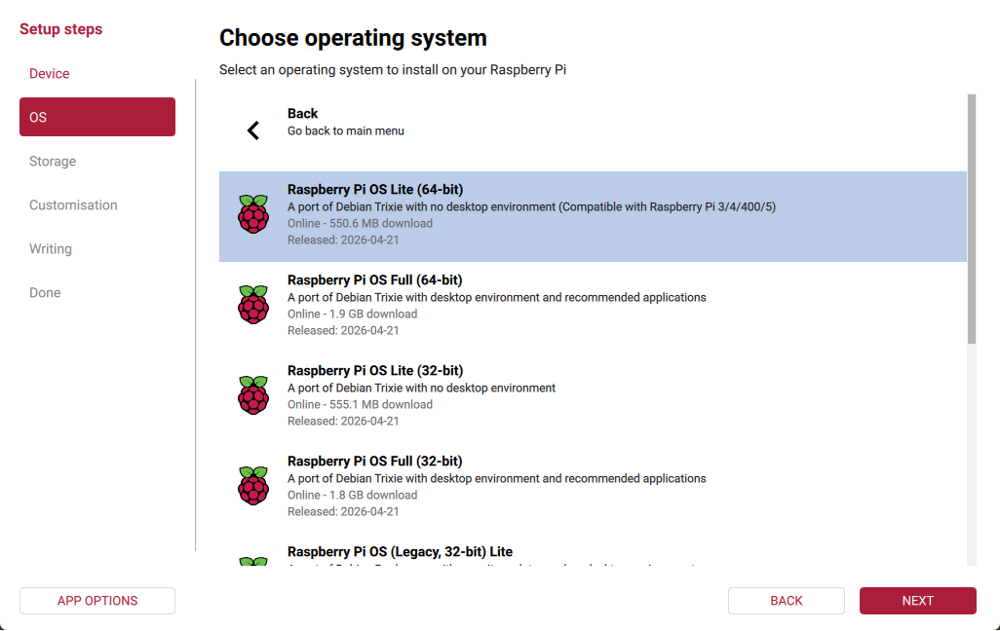{width="600"}

    and then click **NEXT**

4. Connect the SD card or the SD card in a USB adapter to
the computer. On Windows this will usually be called
something like "Generic MassStorageClass USB Device".

    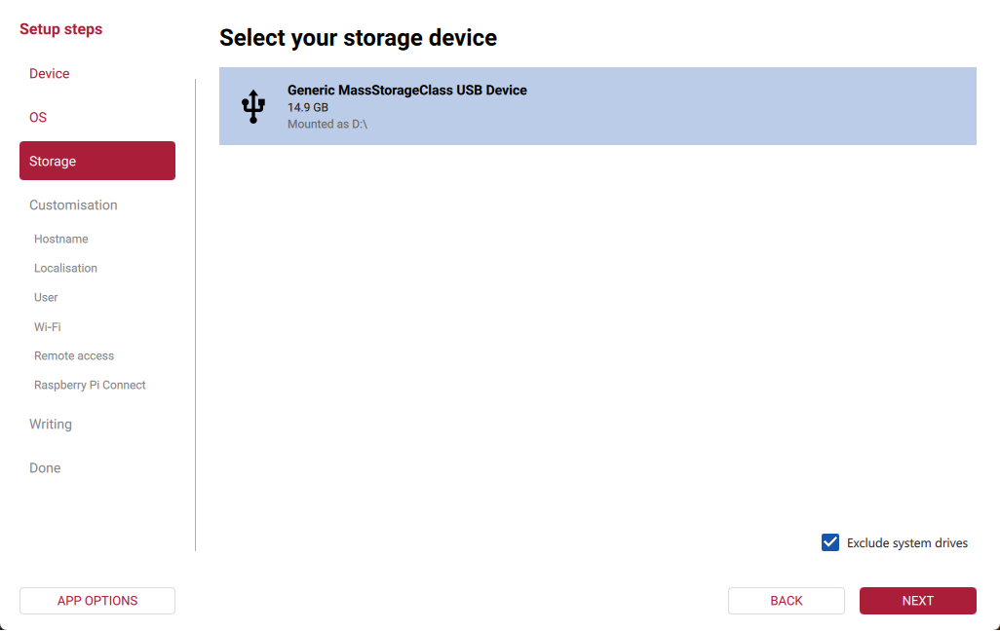{width="600"}

    and then click **NEXT**

5. Enter the hostname as you want it to appear on your
local network. If you don't have any particular name in
mind, enter "firefly" here. This will set the URL of the
logger to `https://firefly.local`. Other hostnames, replace
"firefly" with your hostname in the rest of these directions.

    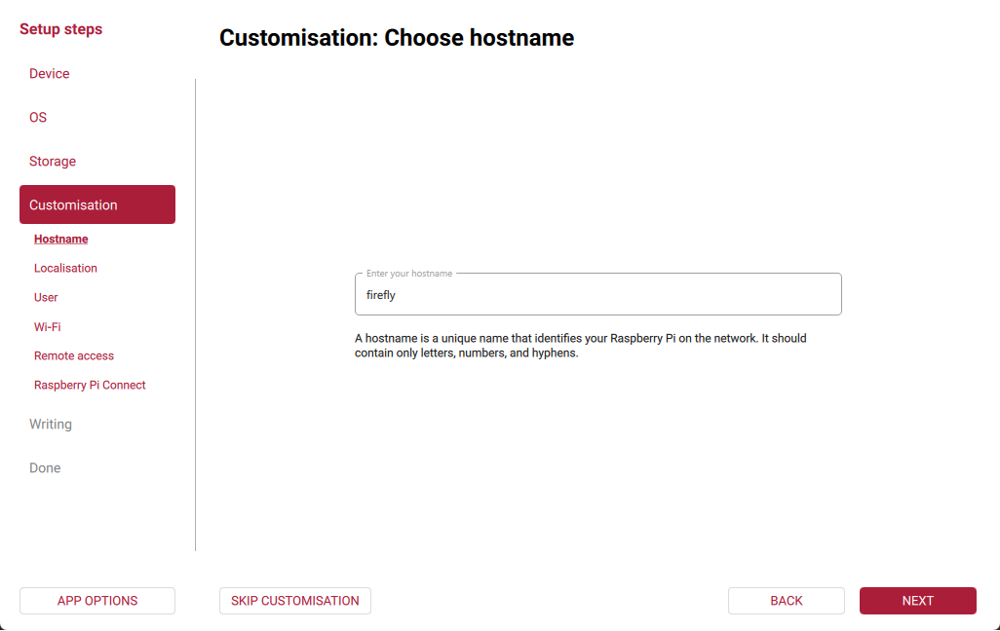{width="600"}

    Click **NEXT**

6. Set your timezone information and click **NEXT**. Note: this selection
will not alter how the logger operates, only the
operating system's time. The logger will always operate
in UTC.

7. Create a user and password for the host and click **NEXT**.
Write this username and password down if you need to. It will
be needed to install the software. Use all lower-case letters
for the username.

    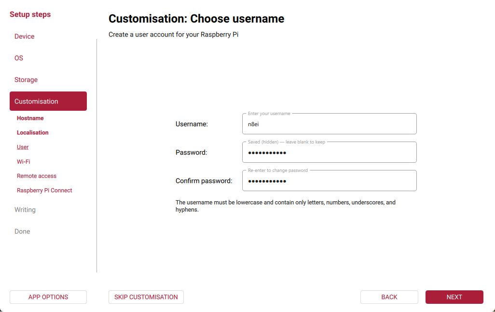{width="600"}

8. Configure your WiFi network by entering your network name
in the "SSID" field and then the password. Click **NEXT**
when completed. If you do not plan to use WiFi, enter nothing
and simply click NEXT.

    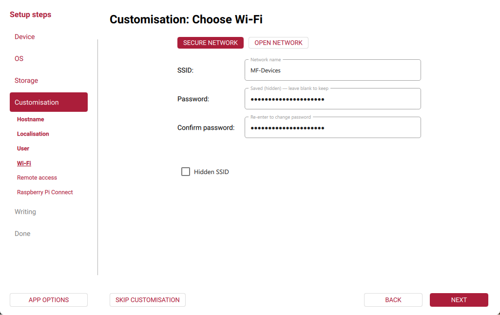{width="600"}

9. Ensure **Enable SSH** is turned on and click **NEXT**

10. Ensure **Enable Raspberry Pi Connect** is __disabled__ and click **NEXT**

11. Confirm the summary details and click **WRITE**.

    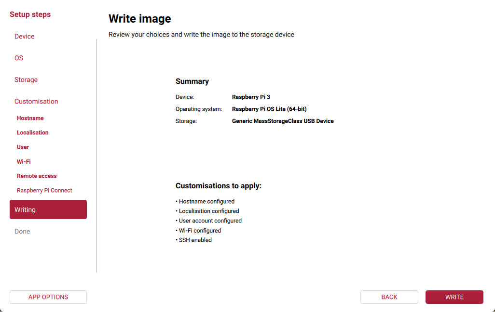{width="600"}

12. Confirm you're ready to write. After a few moments,
the imager will begin writing to the SD card.
Depending on the speed of the computer and the type of SD card
one will have time for a beverage of their choice. When the write is complete,
remove the card from computer and insert it into the Pi. If using a USB adapter
for the SD card, remove the SD card from the adapter and insert the card into
the Pi. The Pi __will not__ use the SD card in the USB adapter.

    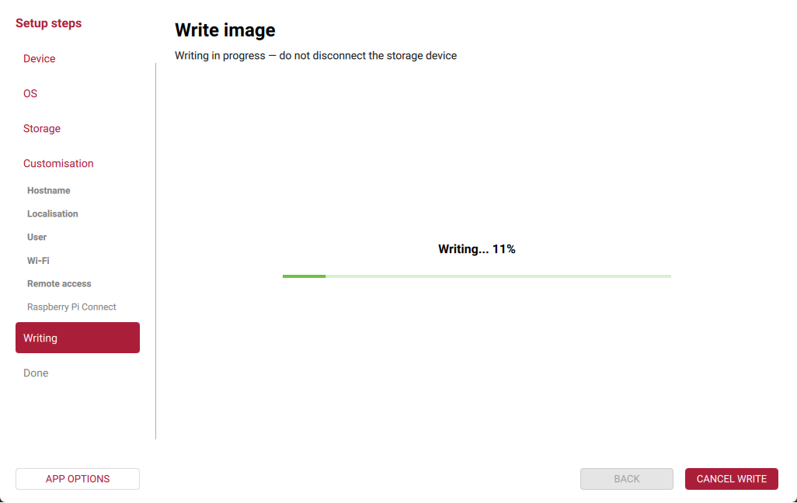{width="600"}

13. Power on the Pi. Wait approximately 5 minutes for the Pi to boot
and perform the various firstboot tasks.

14. (Optional) Network connectivity may be tested using the command
`ping -4 firefly.local` from a command prompt or PowerShell window.

    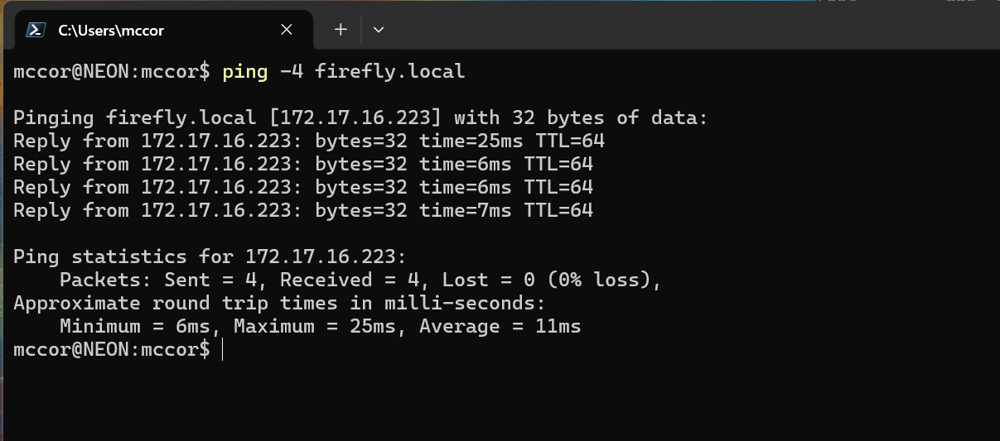{width="600"}

15. SSH into the device. Windows and MacOS both have a built-in SSH
client. The command to execute is `ssh USER@HOSTNAME.local` where
USER is the user you configured during the flash and HOSTNAME19
is the hostname configured. In this example, the SSH command
is `ssh n8ei@firefly.local`:

    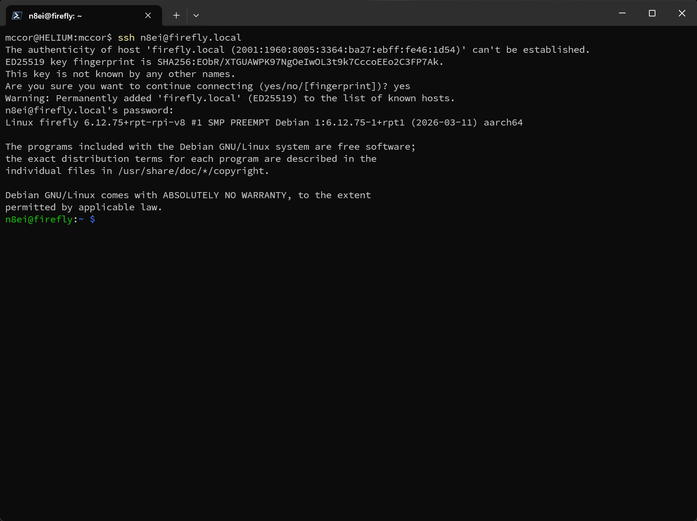

16. Become root by entering the command `sudo -s`. All of the remaining
steps of this installation assume you are operating as the root user.

    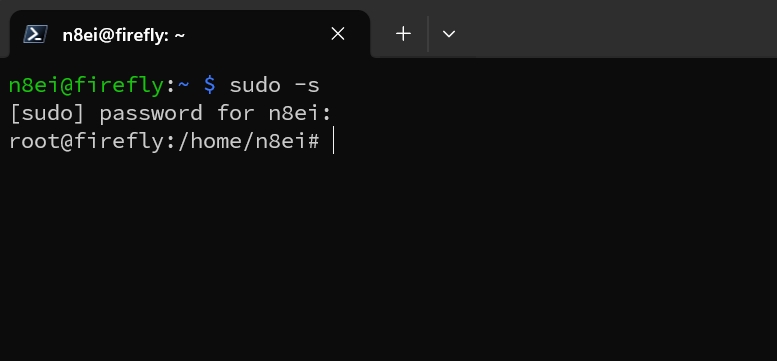{width="600"}

17. Copy and paste in the following commands:

    ```bash
    wget -O/tmp/pw.repo https://repo.packetwarriors.com/packetwarriors-repo_1.1-1.deb13_all.deb
    dpkg -i /tmp/pw.repo
    apt update
    rm /tmp/pw.repo
    ```

    The output will look like:

    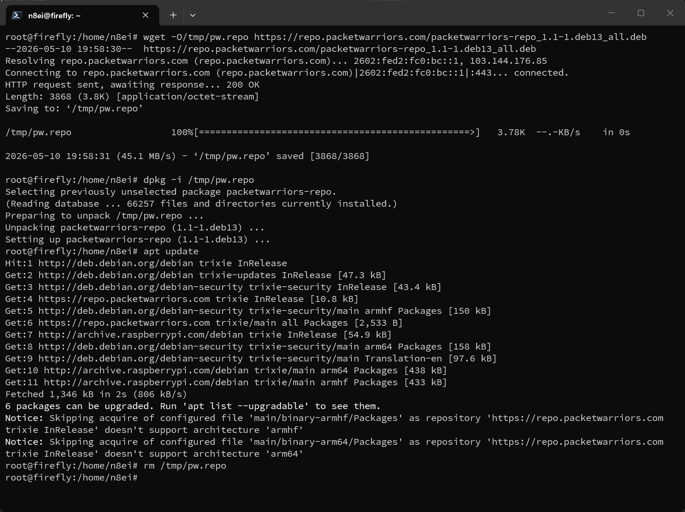

18. Now install the Firefly Logger application by entering the following commands:

    ```bash
    apt upgrade -y
    apt install -y firefly-logger-appliance
    ```

    Many things will be downloaded and installed. The exact contents of the
    output is not important. But watching for failures that will halt the
    install with an obvious error. Depending on the speed if you Pi and the
    speed of your Internet connection, this could take 5-10 minutes.

19. Install the core configuration of Firefly by entering the command:

    ```bash
    firefly-logger-takeover
    ```

    The output will look like:

    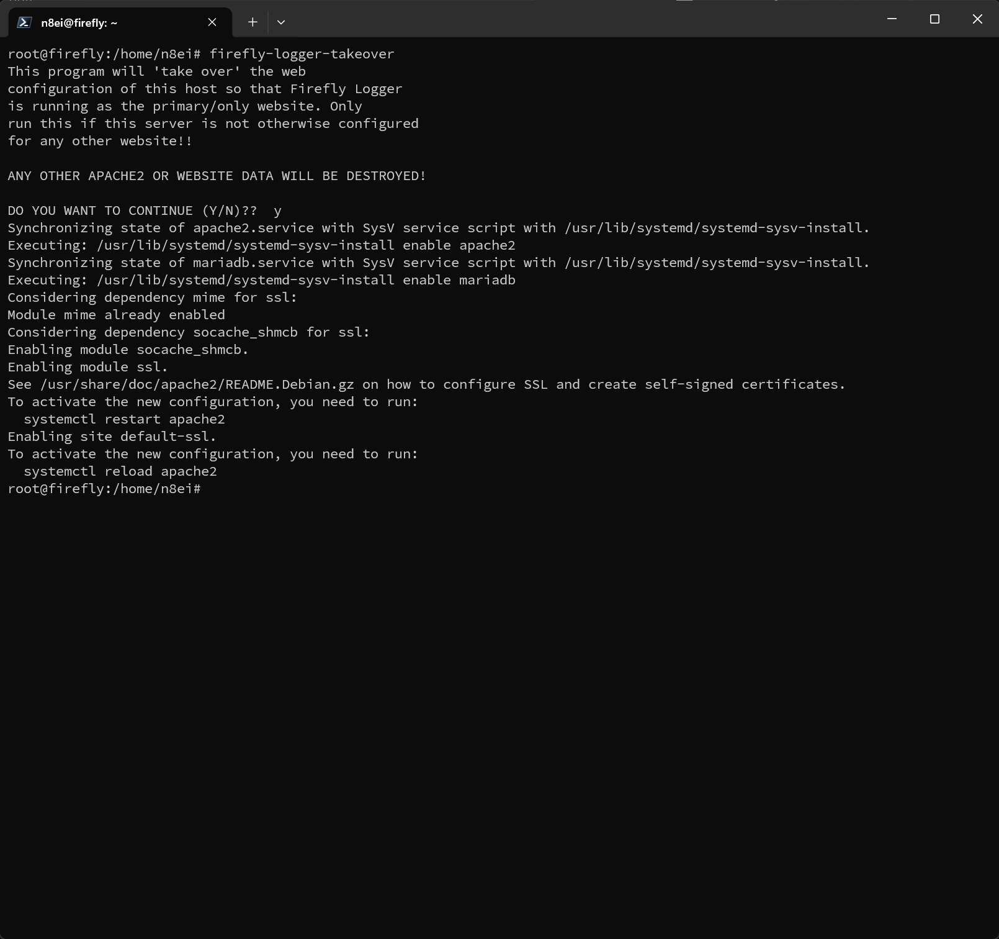

20. Open your browser. Enter `http://firefly.local` into the browser
bar and hit Enter. One may receive a "host not found" error the first
time depending on a variety of factors regarding browsers and networks
that is unimportant here. If that happens, re-enter `http://firefly.local`
and hit Enter a second time. This should then display a warning about an
invalid security certificate or some other form of security error. In Chrome and
Edge it will look like:

    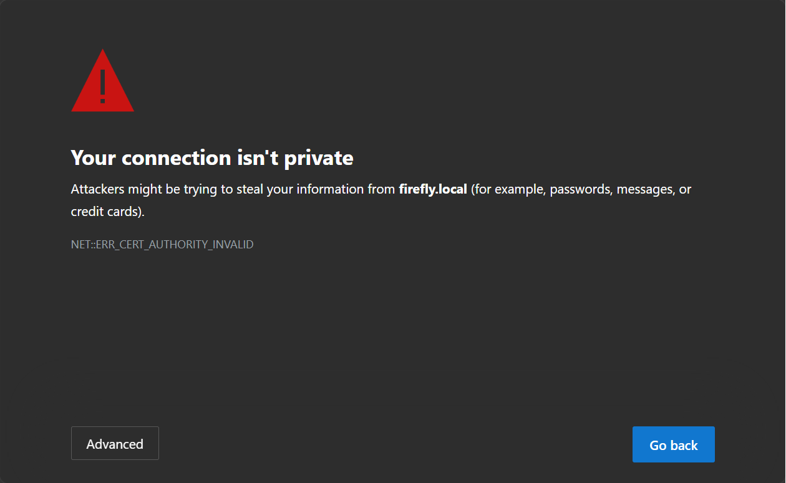{width="600"}

21. Cilck on **Advanced** and then **Continue to firefly.local (unsafe)**.
Firefox, Safari, etc. have similar screens with a similar warning and
workflow. Each client to Firefly Logger will have to accept and/or
continue past the security warning on the first connections.
See [Security](security.md) for more information on why this is not
a security risk for this application.

    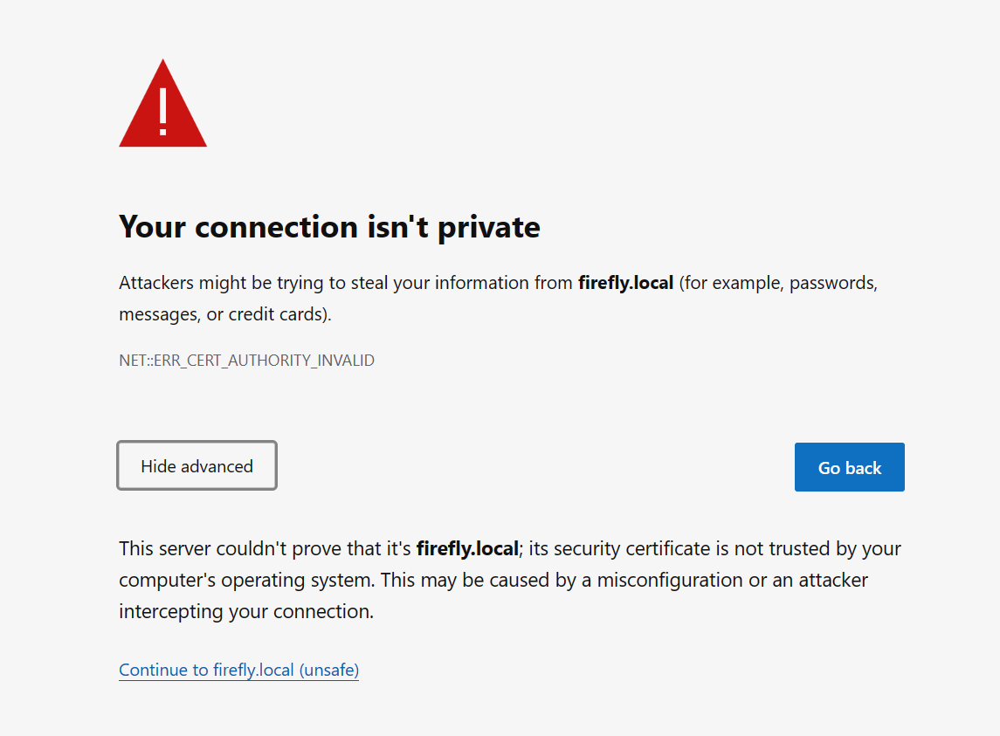{width="600"}

22. Firefly Logger should now be displayed.

    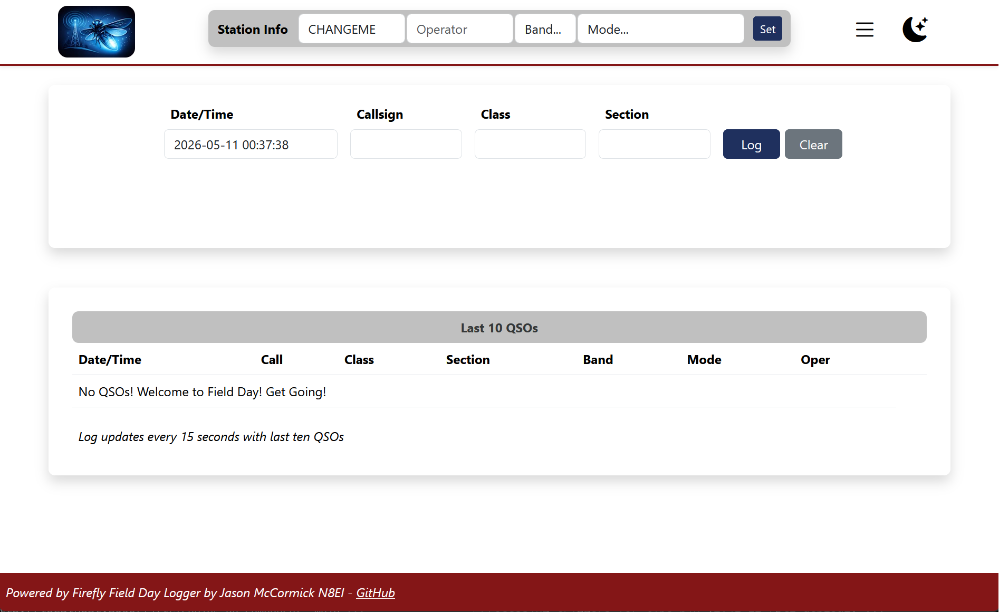{width="600"}

23. Enter and then delete a test QSO to confirm installation.

24. Close your SSH window.

## Next Steps

First, set the basic configuration as described in [Configuration](configs.md).

THen, visit the [User Guide](basic.md) for getting started!

## Updates & Software Installation
The appliance is fully updateable with upstream Debian and the
Firefly Logger software from the PacketWarriors software repository.

The appliance is also capable of running other software as desired
to be configured by the experienced sysadmin. For example, it is perfectly
reasonable to use the Firefly Logger base image as a starting OS for
running other items of interest at Field Day as well such as a time server,
file server, etc. Just keep in mind that the main webserver configuration is
expected to be managed exclusively by Firefly Logger.

Multiple field days are not supported in the database. To reset the log
for the next year, after an upgrade, run `firefly-logger-clearlog` from
the SSH console.