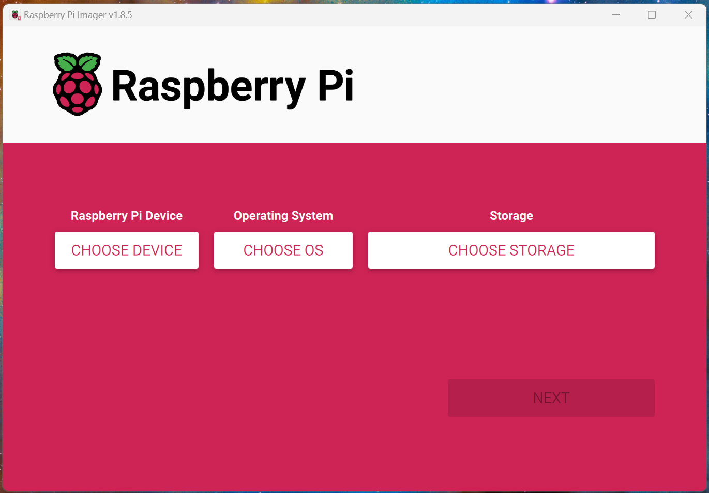
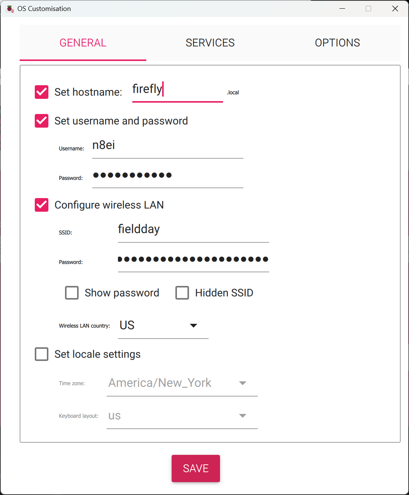

# Appliance Installation

!!! note "Using the Firefly Logger Appliance is the recommended installation type for Firefly Logger."

!!! tip "You *do not* need to follow these directions *and* "Software Installation" "

## Appliance Full Installation Guide

1. If you do not already have it installed, install the
[Raspberry Pi Imager](https://www.raspberrypi.com/software/).

2. Download the latest image from [the Firefly FDL GitHub Release Page](https://github.com/jxmx/firefly-logger/releases/latest) and save it to the
`Downloads` directory.

3. Launch **Raspberry Pi Imager** from the start menu.

    {width="600"}

4. Click on **CHOOSE DEVICE** and choose the type of
Pi hardware on which Firefly Logger is being installed.

    {width="600"}

5. Click on **CHOOSE OS**. Scroll to the bottom of the
list that appears and select **Use custom**. 

    {width="600"}

6. A **Select image** dialog box will appear. Navigate to the
`Downloads` folder and select the image downloaded in step 2.
It will be named something like firefly-logger-5.1-aarch64.img.xz.
Then click **Open**.

    {width="600"}

7. Connect the SD card or the SD card in a USB adapter to
the computer. Then click on **CHOOSE STORAGE**. An option
will be presented named something such as "Mass Storage Device USB
Device - 16.0 GB". Click on that entry.

    {width="600"}

8. Click **NEXT**

9. A box labelled "Use OS customisation?" will appear. Click on
**EDIT SETTINGS**

    {width="600"}

10. Customize the settings for the image to match the needs of the operation.

    {width="600"}

    Check the box and set the hostname of the device. It is *recommended* to use the name `firefly`
    which will set the hostname on the network to `firefly.local`.

    Create the user for the device. Check the box and set a username and password. This
    can be anything, but it is recommended to be set to the operation callsign and a
    memorable password. In this example, the username was "n8ei" and the password "fieldday".
 
    Check the box next to **Configure wireless LAN** and then enter
    the name of the wireless network in **SSID** and the password for
    that network in **Password**. Change the "Wireless LAN country" to **US**
    or other country as appropriate. This is not necessary if the Pi will
    use a network cable rather than wireless.

    (Optional) Check the box next to **Set locale settings** and change the "Time zone"
    to the desired region. This is optional and will not affect Firefly Logger
    using UTC times throughout.

11. Click on the Services tab and click **Enable SSH** and **Use password authentication**

    {width="600"}

12. Click **SAVE** in "OS Customsation".

13. Click **YES** for "Use OS customiation?"

14. Click **YES** to continue to write the image to the SD card.

    {width="600"}

15. Depending on the speed of the computer and the type of SD card
one will have time for a beverage of their choice. When the write is complete,
remove the card from computer and insert it into the Pi. If using a USB adapter
for the SD card, remove the SD card from the adapter and insert the card into
the Pi. The Pi __will not__ use the SD card in the USB adapter.

16. Power on the Pi. Wait approximately 2 minutes for the Pi to boot
and perform the various firstboot tasks.

17. (Optional) Network connectivity may be tested using the command
`ping -4 firefly.local` from a command prompt or PowerShell window.

    {width="600"}

18. Open your browser. Enter `http://firefly.local` into the browser
bar and hit Enter. One may receive a "host not found" error the first
time depending on a variety of factors regarding browsers and networks
that is unimportant here. If that happens, re-enter `http://firefly.local`
and hit Enter a second time. 
    
    {width="600"}

19. This should then display a warning about an invalid security
  certificate or some other form of security error. In Chrome and
  Edge it will look like:
  
    {width="600"}

20. Cilck on **Advanced** and then **Continue to firefly.local (unsafe)**.
Firefox, Safari, etc. have similar screens with a similar warning and
workflow. Each client to Firefly Logger will have to accept and/or
continue past the security warning on the first connections.
See [Security](security.md) for more information on why this is not
a security risk for this application.
    
    {width="600"}

21. Firefly Logger should now be displayed.
    
    {width="600"}

22. Enter and then delete a test QSO to confirm installation.

That's it! Visit the [User Guide](basic.md) for getting started!

## Updates & Software Installation
The appliance is fully updateable with upstream Debian and the
Firefly Logger software from the PacketWarriors software repository.

The appliance is also capable of running other software as desired
to be configured by the experienced sysadmin. For example, it is perfectly
reasonable to use the Firefly Logger base image as a starting OS for
running other items of interest at Field Day as well such as a time server,
file server, etc. Just keep in mind that the main webserver configuration is
expected to be managed exclusively by Firefly Logger.