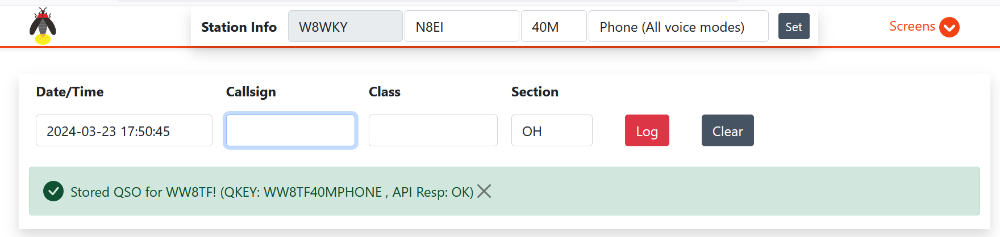
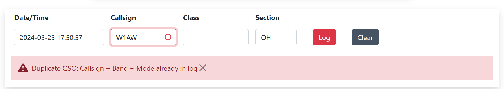
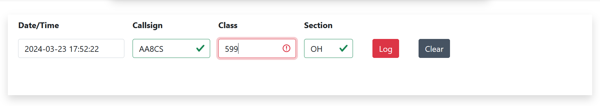
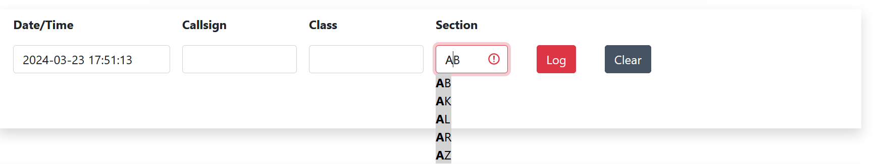

# Basic Use

Firefly Field Day Logger is intended to be an intuitive logger
system. It supports many concurrent users with a minimal footprint.
For each operator, the basic use pattern should be followed:

1. Open a web browser and point it to the hostname or IP address
of your server. Using the Pi appliance, this is `https//fieldday.local` 
or the name of the device as chosen during installation.

2. Set the station information at the top of the screen. The **callsign**
is the overall callsign used for the activity. The **operator** is
the particular station operator's personal callsign. Callsign and
Operator can be the same call if it's a single-operator situation.
Use of multi-operation logging can be disabled in [the configuration](configs.md).

3. Begin logging!

## Successful Entry
All connected logger clients (web browser) will poll the server
for updated contact information and to check for duplicates. For example,
a successful contact will look like this:

## Duplicate Entry
However, if the station has already been worked, the entry
screen will report an error and the entry will not be permitted:

## Input Sanitization
All input is sanitized for proper formatting. For example,
the callsign field will check for general well-formatted callsigns.
However it will not validate any particular callsign is a valid
call. The class field similarly will only permit inputting of
appropriate ARRL Field Day or Winter Field Day class information.

## Typeahead Convenience
The section field is controlled by a typeahead convenience
feature that will both display and allow for a quick-tab once
enough characters have been types to match the section. This
also provides convenience to the operator to not have to be 
consulting a sheet while operating.

## Keyboard Navigation
After setting the operator information at the top and clicking
for the first time in the Callsign box, navigation is designed
to be done entirely from the keyboard. The page layout and nav
items for logging are fixed so that the operator may enter
the callsign, class, and section while tabbing between them
and pressting Enter to store the QSO. Then the input
will return to the Callsign box for the next Q. The pattern of 
good logging would be:

**Enter Callsign** `TAB` **Enter Class** `TAB` **Enter Section** `ENTER`

## Testing after Installation

To test that the system is installed properly:

1. Add a QSO

2. Edit a QSO

3. Delete a QSO

If those three operations work, you have a successful installation.

To clear out test QSOs and/or to reset the log, as the root user execute `firefly-logger-clearlog`.

