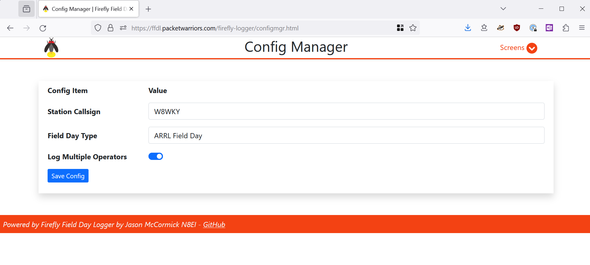

# Configuration

There is minimal configuration necessary. 

## In-App Configuration Options
Options needed for all installations are in the **Screens** -> 
**Config Mgr**. The options should be self-explanatory.

**Station Callsign** is the callsign of the operation.

**Field Day Type** is selectable between *ARRL Field Day* and *Winter Field Day*.

The **Log Multiple Operators** toggle simple enables or disables the feature
where each entry has a separate Station Call and Operator Call. This feature
is useful when operators want to see their performance but it can get scrambled
if people are not diligent about setting a new operator callsign.

## Hard-Coded Configuration

### ARRL/RAC Section List
The ARRL/RAC section list is statically stored in a JSON file for 
performance reasons. The ARRL/RAC list is maintained by the project. However,
to alter the ARRL/RAC section list, add or remove the appropriate
items in `api/config_sections.json`. The formatting and capitalization
of the file is important.

Note: `config_sections.json` is not expected to be a customized file
long-term and the upgrade packages will overwrite this file.

### Bands List
The band list os statically stored in a JSON file for performance reasons.
To add or remove the bands in the list, edit the file `api/config_bands.json`.
Users of `adif.php` and `cabrillo.php` will also have to hand-edit those 
export functions to map added bands appropriately.

Note: `config_bands.json`, `adif.php`, and `cabrillo.php` are not expected
to be customized files long-term and the upgrade packages will overwrite them.

### Modes List
The mode list is statically stored in a JSON file for performance reasons.
It is not recommended to edit this list unless you're an experienced
developer. The list is `api/config_modes.json`.

Note: `config_modes.json` is not expected to be a customized file
long-term and the upgrade packages will overwrite this file.