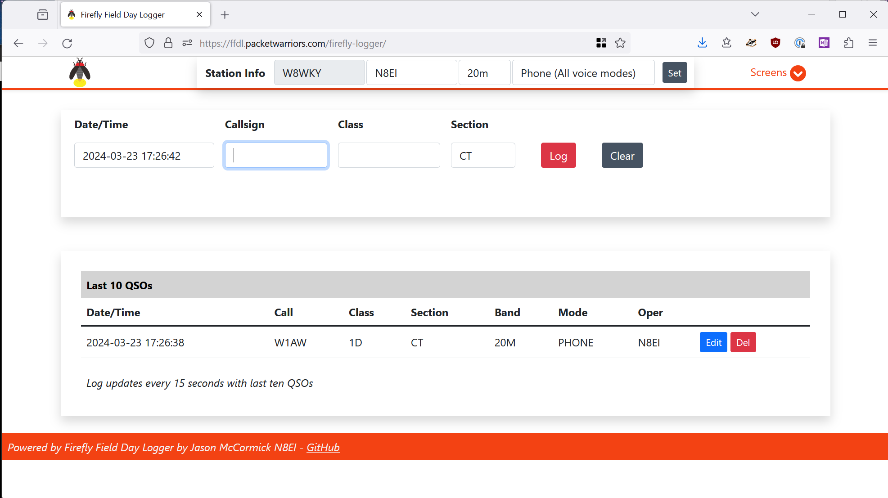

# Firefly Logger

Firefly Field Day Logger is a web application for use 
at [ARRL Field Day](http://www.arrl.org/field-day) operating events. 
It can also be used for [WFDA Winter Field Day](https://winterfieldday.org/).

The design of this logger is to be a simple, effective logger that 
can be used on any device that can have a reasonably modern browser
installed on it. This includes older laptops running Linux + Chromium,
tablets with Chrome or Firefox, Raspberry Pi 3, 4, or 5 with Raspian, etc.
FFDL has been tested on Windows, Linux, iOS, and Android using the
native browsers on each platform. In short, if a reasonably recent
browser can be installed, Firefly Logger will work for you.

## Features
- Full client in a browser; operates seamlessly across multiple, low-powered devices such as old laptops running lightweight Linux, Pis, low-cost tablets
- Network environment for common operating picture
- No internet access or required for operation
- Realtime duplicates checking/avoidance
- Format checking on all fields for high-accuracy logging
- Ability to hand-key paper logs as needed
- Does not require the Internet; Operate over a disconnected local network or WiFi
- Display page for showing on a screen at Field Days to show score and points
- ADIF export for Logbook of the World (LoTW) or other logging programs
- Cabrillo export for score reporting
- WSJT integration (with [companion wjst2ffdl](https://github.com/jxmx/wsjt2ffdl/) package)

[Project Home Page](https://packetwarriors/firefly-logger) | [GitHub](https://github.com/jxmx/firefly-logger)