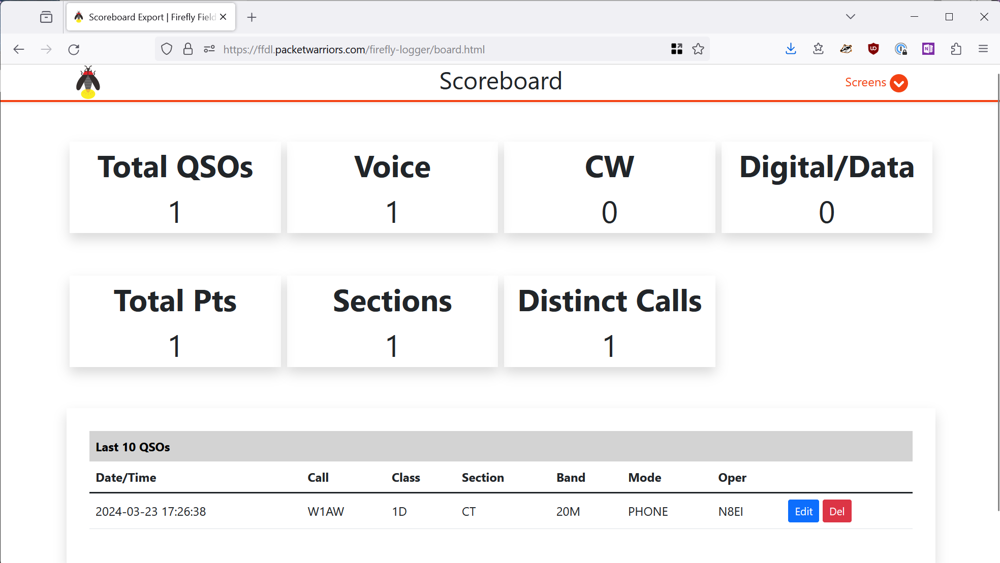
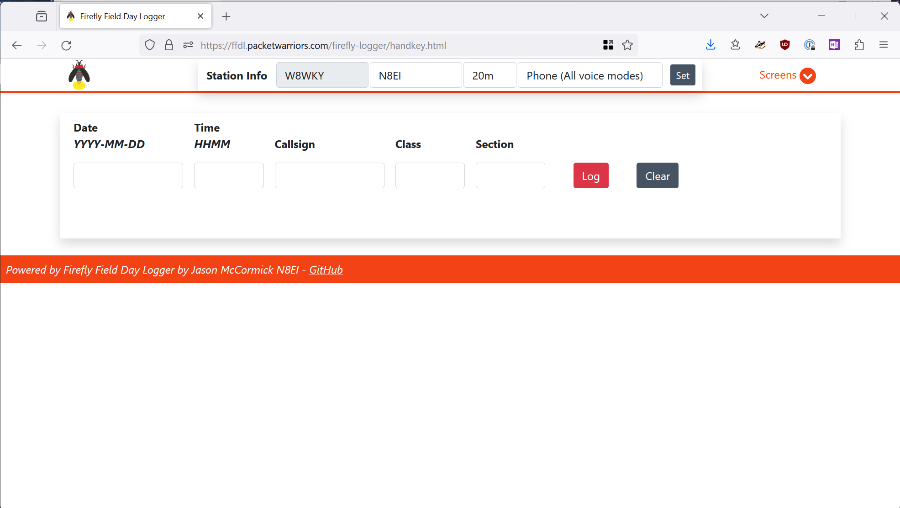
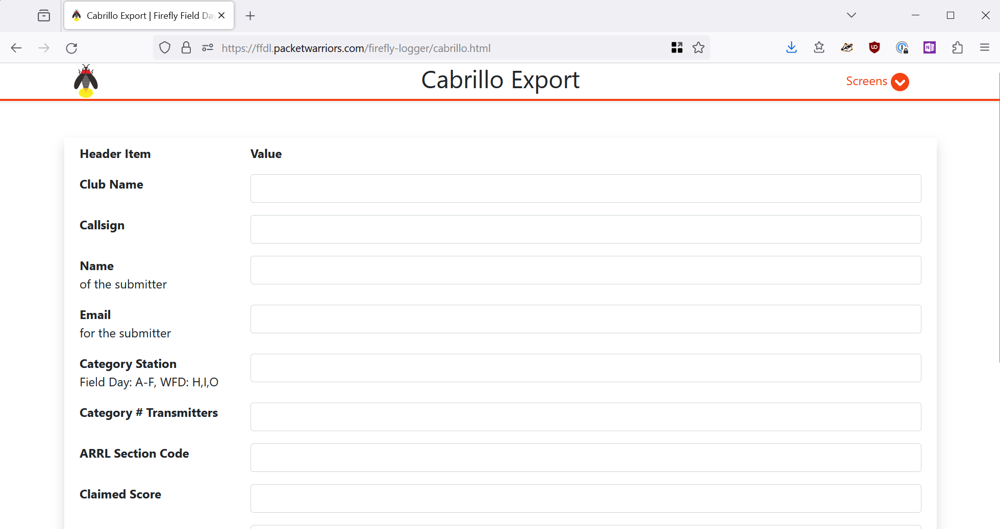
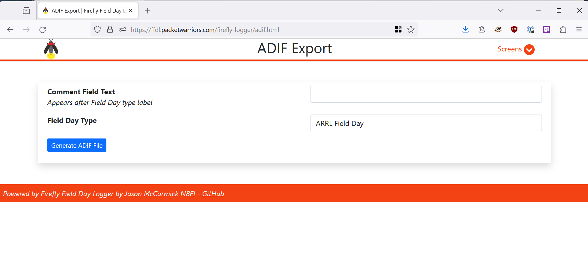
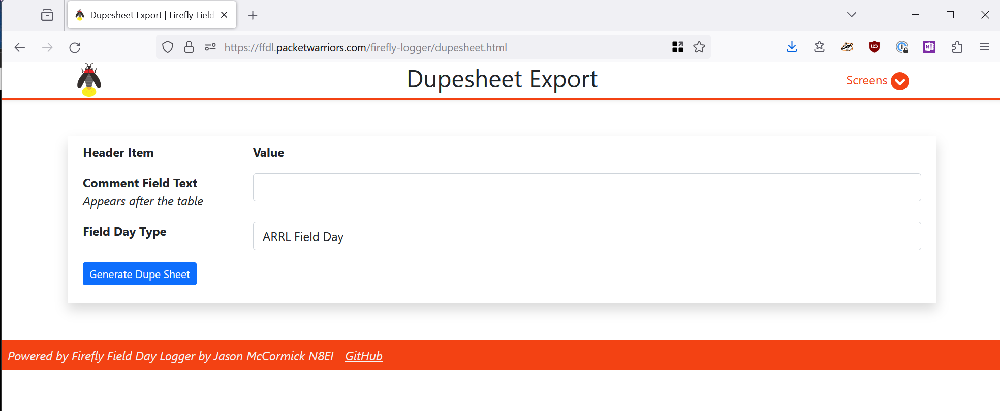
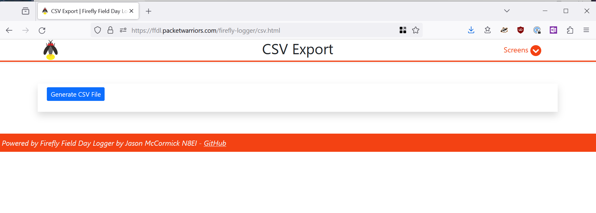

# Screens
The concept of "Screens" is the main UI paradigm in Firefly Logger. The following screens are available in the system.

## Logger
The main logger interface used by most people. Each operator sets their operating
details at the top and then can immediately begin logging.

## Display Board
This "brag board" for displaying on a large screen or with a projector from the
event to keep track of progress.

## Handkey Interface
The Handkey screen is used to manually enter contacts if someone is unable
or unwilling to use the electronic logging system. 

## Export Cabrillo
The Export Cabrillo screen exports the log as a Cabrillo-formatted file for 
score submissions. Fill in all items as desired and then click 
**Generate Cabrillo File**. The browser will download a Cabrillo-formatted
text log named `fieldday.log`.

## Export ADIF
The Export ADIF screen exports the log as a ADIF-formatted file
for log recording in LOTW or import into other loggers. Fill in
any desired information and then click **Generate ADIF File**. The
browser will download an ADIF-formatted text log named `fieldday.adi`.

## Export Dupsheet
The Export Dupsheet screen export the ARRL-required "dup sheet" format for
submissions. Enter any comment desired and then click **Generate Dup Sheet**.
A text dupesheet named `fd-dupsheet.txt` will be downloaded by the browser.

## Export CSV
The Export CSV screen exports the log as a comma-separate values file suitable for 
editing in Excel or Google Docs, or for importing into some other system
as necessary.

