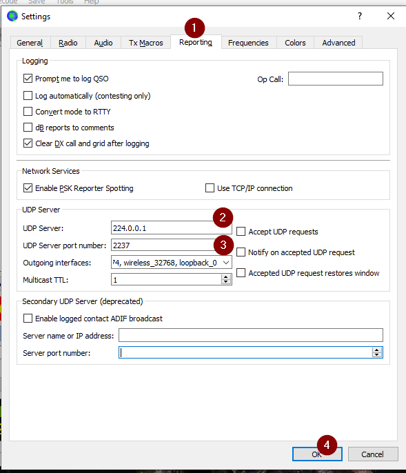

# Configuring WSJT-X for Firefly Logger

Use the following steps in WSJT-X to configure it to log
to Firefly Logger over the network automatically for each
QSO.

1. Open the main screen of WSJT-X.

2. Choose **File -> Settings...**.

3. Click on the Advanced (#1) tab of the Settings.

4. In **UDP Server** enter `224.0.0.1` (#2)

5. In **UDP Server port number** enter `2237` (#3)

6. In **Outgoing interfaces**, check ALL boxes.

7. Click **OK**

